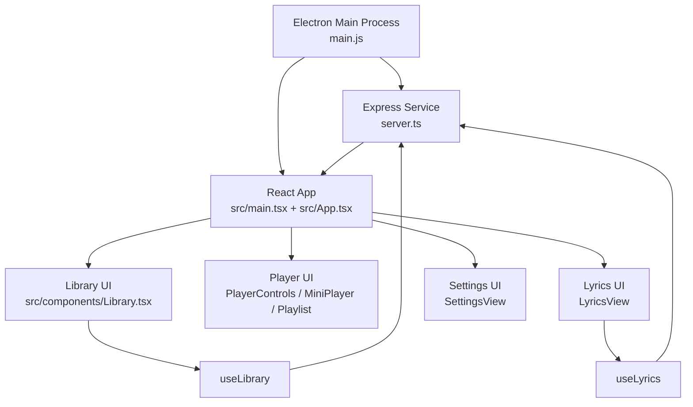
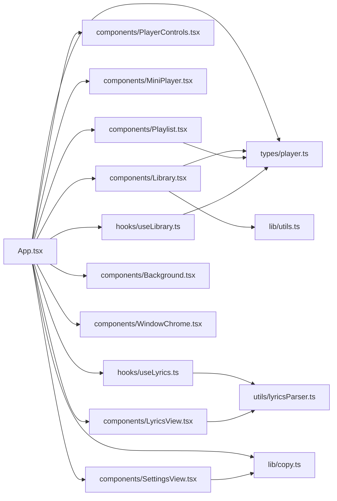
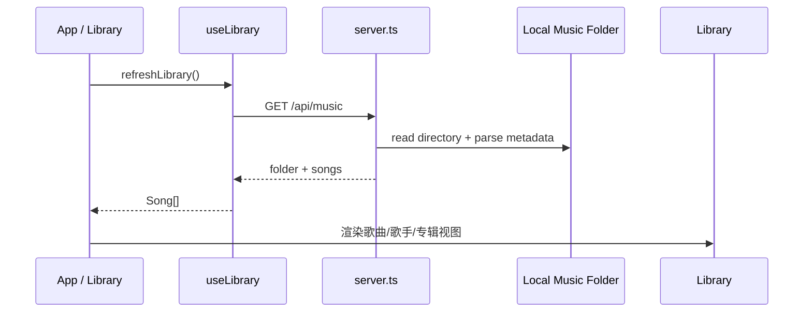
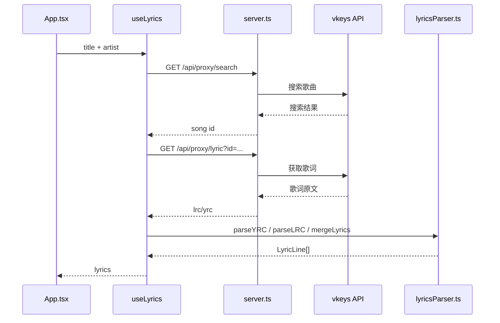

# RadiFlow Player 开发者手册

## 1. 文档目标

本文档面向后续维护和功能迭代，目标不是做产品介绍，而是帮助开发者快速回答下面几个问题：

- 项目由哪些运行层组成
- 关键模块之间如何依赖
- 某个功能应该改哪几个文件
- 数据和状态是如何流动的
- 修改后应该检查哪些回归点

适用对象：

- 新加入项目的开发者
- 需要继续做 UI、功能、性能优化的维护者
- 需要快速定位模块边界和职责的协作者

---

## 2. 技术栈

### 2.1 运行时

- Electron 41
- Node.js
- Express 4
- React 19
- TypeScript 5
- Vite 6

### 2.2 UI 与动画

- Tailwind CSS 4
- motion/react
- lucide-react

### 2.3 媒体与音频

- HTMLAudioElement
- Web Audio API
- music-metadata
- colorthief

### 2.4 工具库

- clsx
- tailwind-merge
- concurrently
- wait-on
- tsx

---

## 3. 系统分层

项目由三层组成：

1. Electron 主进程层：负责窗口、桌面交互和 IPC。
2. 本地服务层：负责媒体库扫描、歌词代理、静态音频访问。
3. React 前端层：负责播放器、媒体库、播放列表、设置等全部 UI 与状态管理。

### 3.1 分层职责图



### 3.2 前端模块依赖图



---

## 4. 启动与运行链路

## 4.1 开发环境启动流程

1. 执行 npm install 安装依赖。
2. 执行 npm run dev，启动 server.ts。
3. server.ts 在开发环境下挂载 Vite 中间件。
4. 执行 npm run electron:dev，Electron 等待 http://localhost:3000 可访问。
5. Electron 创建窗口并加载前端页面。
6. React 启动后初始化媒体库、播放列表、偏好设置、播放会话。

## 4.2 生产环境（打包）启动流程

1. 执行 `npm run build`，Vite 生成 `dist/`（base: './' 相对路径），esbuild 生成 `dist-electron/server.js`。
2. 执行 `npx electron-builder --win dir portable nsis`，产物在 `release/`。
3. 打包应用启动时，Electron 主进程调用 `startPackagedLocalServer()`，把内嵌的 `dist-electron/server.js` 以子进程方式启动。
4. Express 服务优先绑定稳定端口（见"端口稳定性"章节），产生 `http://127.0.0.1:PORT/`。
5. 主进程窗口加载上述 URL，前端通过 `/api/*` 访问本地服务。

### 端口稳定性设计

`localStorage` 按 origin（协议 + 主机 + 端口）隔离。打包版若每次随机端口，则所有偏好设置（背景图、模糊值等）都无法跨启动持久化。

`startPackagedLocalServer()` 的端口选择策略：

1. 读取 `userData/server-port.json` 中上次成功绑定的端口，优先复用。
2. 依次尝试固定端口段 37531–37550。
3. 若全部被占用，回退到 `port: 0`（OS 随机分配）。
4. 成功绑定后，把端口号写入 `userData/server-port.json`，供下次使用。

## 4.3 常用命令

```bash
npm install
npm run dev
npm run electron:dev
npm run lint
npm run build
npm run preview

# 打包
npx electron-builder --win dir portable nsis
```

---

## 5. 目录结构

```text
.
├─ index.html
├─ LICENSE
├─ main.js
├─ metadata.json
├─ package.json
├─ README.md
├─ DOCUMENT.md
├─ server.ts
├─ tsconfig.json
├─ vite.config.ts
├─ music/
├─ dist/
└─ src/
   ├─ App.tsx
   ├─ index.css
   ├─ main.tsx
   ├─ components/
   ├─ hooks/
   ├─ lib/
   ├─ types/
   └─ utils/
```

---

## 6. 根目录文件说明

### index.html

- 前端 HTML 模板。
- 提供 root 挂载节点。

### main.js

- Electron 主进程入口。
- 管理 BrowserWindow、快捷键、窗口控制 IPC、音乐目录选择 IPC。

### server.ts

- Express 本地服务入口。
- 负责媒体库扫描、封面提取、歌词代理、静态音频资源访问。

### package.json

- 定义项目脚本和依赖。
- 关键脚本：dev、electron:dev、build、lint。

### tsconfig.json

- TypeScript 编译配置。
- 使用 bundler 模块解析，jsx 为 react-jsx。

### vite.config.ts

- Vite 配置文件。
- 集成 React 与 Tailwind。
- 提供别名和 HMR 控制。

### metadata.json

- 项目元信息文件。
- 当前不参与核心业务逻辑。

### README.md

- 面向外部的简要说明文档。
- 信息量较少，完整维护说明以本手册为准。

### music/

- 默认本地媒体目录。
- server.ts 启动时会确保该目录存在。

### dist/

- Vite 构建输出目录。

---

## 7. src 目录说明

## 7.1 应用入口

### src/main.tsx

职责：

- 挂载 React 应用。
- 将 Buffer 和 process 注入 window，兼容 Electron 运行环境。

### src/App.tsx

职责：

- 项目级状态中心。
- 管理播放状态、媒体库状态、播放列表、偏好设置、窗口状态、播放会话恢复。
- 决定显示 Library 视图还是 Player 视图。
- 串联 hooks、组件和本地存储。

这是当前项目的主编排层。

---

## 7.2 components 目录说明

### Background.tsx

职责：

- 根据当前封面生成沉浸式背景。
- blur 模式直接模糊封面。
- streamer 模式基于 colorthief 提取配色后生成流式背景。

### Library.tsx

职责：

- 媒体库主界面。
- 支持歌曲、歌手、专辑、搜索、播放列表浏览。
- 内部负责搜索过滤、歌手分组、专辑分组、滚动头部和内容视口效果。
- 当前也是滚动性能优化的主要落点。

当前已知特点：

- 文件体量较大
- UI 改动频繁
- 滚动、模糊、动画与列表渲染耦合度高

### LyricsView.tsx

职责：

- 渲染歌词内容。
- 根据当前播放时间定位当前行。
- 激活行自动滚动到可视区域。
- 支持逐词高亮和翻译歌词显示。

### MiniPlayer.tsx

职责：

- 页面底部悬浮迷你播放器。
- 提供播放控制和音量控制入口。
- 支持点击进入完整播放器视图。

### PlayerControls.tsx

职责：

- 完整播放器控制区。
- 管理进度条、播放按钮、随机播放、循环模式、歌词面板开关、播放队列开关。

### Playlist.tsx

职责：

- 展示播放队列或列表歌曲。
- 当前播放项高亮。
- 支持删除单曲。

### SettingsView.tsx

职责：

- 设置页 UI。
- 管理语言、媒体库目录、背景效果和应用信息。

### SpectrumVisualizer.tsx

职责：

- 使用 canvas 绘制频谱可视化效果。
- 数据来源为 Web Audio API 分析器。

### WindowChrome.tsx

职责：

- 自定义窗口标题栏。
- 负责拖拽区域、最小化、最大化、关闭按钮。

### DetachedMiniPlayerWindow.tsx

职责：

- 预留的独立迷你播放器窗口组件。
- 包含独立封面、歌词、进度和窗口控制布局。

当前状态：

- 未在 App.tsx 中接入主流程。

### Sidebar.tsx

职责：

- 早期侧边栏封装组件。
- 包含导航项与播放列表区域。

当前状态：

- 当前主页面已经在 App.tsx 中直接实现侧边栏布局。
- 该文件更接近遗留/备用实现。

---

## 7.3 hooks 目录说明

### useLibrary.ts

职责：

- 从 /api/music 读取媒体库。
- 处理 Electron 目录选择与目录打开能力。
- 将后端返回的 LibrarySongPayload 转换为前端 Song。

当前约束：

- 不再使用落盘缓存。
- 首次启动和手动刷新都走实时扫描。

### useLyrics.ts

职责：

- 根据当前歌曲异步获取歌词。
- 调用服务层代理接口搜索歌曲与歌词。
- 内部使用 Map 做歌词请求缓存。

---

## 7.4 lib 目录说明

### copy.ts

- 项目多语言文案中心。
- 定义 zh-CN 与 en-US 文案结构。
- 当前多个组件直接消费其中的设置文案或公共文案。

### utils.ts

- 提供 cn 工具函数。
- 统一合并 Tailwind className。

---

## 7.5 types 目录说明

### player.ts

职责：

- 定义 Song、LibrarySongPayload、StoredPlaylist、StoredPreferences、StoredPlaybackSession 等核心类型。
- 提供歌曲 identity 和播放列表重建工具函数。

---

## 7.6 utils 目录说明

### lyricsParser.ts

职责：

- 解析 LRC 和 YRC。
- 支持多时间戳、翻译歌词、逐词时间信息。
- 输出 LyricsView 可直接消费的 LyricLine 结构。

---

## 8. 核心状态与数据模型

## 8.1 关键类型

### Song

- title
- artist
- album
- cover
- lrc
- file

### LibrarySongPayload

- 后端媒体库扫描返回结构。
- 与 Song 的区别在于 file 使用 fileUrl，且包含 filename。

### StoredPlaylist

- 播放列表持久化结构。
- 只存歌曲 identity，不直接存完整 Song。

### StoredPreferences

- 语言、背景效果、音量、循环模式、随机播放状态。

### StoredPlaybackSession

- 当前播放队列 identity、当前歌曲、播放时间、播放状态、播放器视图状态。

---

## 9. 数据流说明

## 9.1 媒体库数据流



## 9.2 歌词数据流



## 9.3 播放状态流

1. App.tsx 维护 audioRef、playbackQueue、currentIndex、song。
2. 用户点击媒体库或播放列表后调用 playSongs。
3. App.tsx 设置当前队列、当前索引、当前歌曲、音频 src。
4. PlayerControls、MiniPlayer、Playlist、LyricsView 通过 props 共享播放状态。

---

## 10. 本地持久化说明

项目当前使用 localStorage，未引入数据库。

### 播放列表

- key: apple-music-style-player.playlists

### 偏好设置

- key: apple-music-style-player.preferences

### 播放会话

- key: apple-music-style-player.playback-session

维护注意：

- 修改数据结构时，优先考虑 version 字段与向后兼容。
- 更改歌曲 identity 规则时，需要同步检查播放列表恢复和会话恢复逻辑。
- localStorage 由 origin 隔离。打包版 Express 必须绑定稳定端口（见 4.2 节），否则每次启动都是新 origin，所有设置全部丢失。

### userData 目录（Electron 独占，仅打包版有效）

Electron 的 `app.getPath('userData')` 路径用于跨重启的系统级持久化：

| 文件 | 用途 |
|---|---|
| `shell-preferences.json` | 窗口壳层偏好（transparentWindow 布尔值） |
| `server-port.json` | 上次成功绑定的 Express 端口号，确保 localStorage origin 跨启动一致 |

---

## 11. 服务层说明

### server.ts 中的主要接口

#### GET /api/music

- 扫描当前媒体库目录
- 返回 folder 和 songs

#### POST /api/settings/music-dir

- 更新当前媒体库目录

#### GET /api/settings/music-dir

- 返回当前目录

#### GET /api/proxy/search

- 代理第三方歌曲搜索接口

#### GET /api/proxy/lyric

- 代理第三方歌词接口

### 媒体扫描实现特点

- 仅扫描一层目录，不递归子目录
- 通过 metadataCache 做内存缓存
- 封面图被转成 data URL 返回给前端

维护注意：

- 如果未来需要递归扫描，请优先改 readLibrarySongs。
- 如果未来需要支持更多格式，请先扩展 AUDIO_EXTENSIONS。

---

## 12. Electron 主进程说明

### main.js 中的 IPC 通道

#### 窗口控制
- `window:minimize` — 最小化窗口
- `window:toggle-maximize` — 切换最大化
- `window:close` — 关闭窗口
- `window:is-maximized` — 返回最大化状态布尔值

#### 窗口背景材质与壳层
- `window:get-shell-state` — 返回 `{ supported, systemVersion, minimumVersion, transparentWindow }`
- `window:restart-with-shell-mode(transparentWindow: boolean)` — 写入 shell 偏好后 `app.relaunch()`
- `window:set-background-material(mode)` — 设置 Mica/Acrylic/none 背景材质（需 Windows 11 22H2+）

#### 媒体库
- `select-music-folder` — 打开目录选择对话框
- `get-music-folder` — 返回当前媒体库目录
- `open-music-folder` — 用文件管理器打开目录

#### 其他
- `app:open-external(url)` — 用默认浏览器打开外部链接
- `window:flash-frame` — 窗口闪烁提示（托盘最小化时）

### 全局快捷键

- MediaPlayPause
- MediaNextTrack
- MediaPreviousTrack

维护注意：

- 所有窗口行为改动都要同时检查 WindowChrome.tsx。
- 所有目录选择行为改动都要同时检查 useLibrary.ts 和 SettingsView.tsx。
- `window:restart-with-shell-mode` 会调用 `app.relaunch() + app.exit(0)`，进程完全重启。重启后 Express 会优先复用 `server-port.json` 中的端口，保持 localStorage origin 不变。

---

## 13. 样式与视觉层说明

### 全局样式

src/index.css 提供：

- 全局高度设置
- 全局隐藏滚动条
- scrollbar-hide 工具类
- mask-fade-edges 工具类

### 当前媒体库视觉实现

Library.tsx 当前包含：

- 缩放头部
- 内容视口圆角
- 上下模糊条带
- 大量卡片/列表项的 grid 与 list 视图

维护注意：

- 视觉效果和滚动性能在这个文件里耦合较深。
- 修改模糊、滚动和圆角时，优先检查是否影响重渲染频率。

---

## 14. 性能相关现状

目前已经做过的优化包括：

- 滚动状态按帧节流
- 只在视觉状态变化时更新滚动 UI 状态
- SongCard / CollectionCard / SongListItem 使用 memo
- 使用 content-visibility 和 containIntrinsicSize
- 图片 lazy loading
- 图片 async decoding

性能敏感区域：

- Library.tsx 中的大量卡片渲染
- motion 在大列表中的入场动画
- 背景模糊与边缘模糊的 GPU 开销
- 大图封面和频繁滚动同时发生时的合成压力

---

## 15. 典型改动指南

下面的指南用于回答“要做某种改动时，先看哪些文件”。

## 15.1 修改媒体库扫描逻辑

目标示例：

- 支持更多音频格式
- 递归扫描子目录
- 改变专辑封面获取策略

优先修改文件：

- server.ts
- src/types/player.ts
- src/hooks/useLibrary.ts

检查项：

- /api/music 返回结构是否变化
- 前端 Song 转换是否仍正确
- 媒体库加载失败时的降级处理是否正常

## 15.2 修改媒体库 UI 或浏览逻辑

目标示例：

- 新增筛选器
- 调整专辑/歌手布局
- 修改滚动头部或模糊效果

优先修改文件：

- src/components/Library.tsx
- src/lib/copy.ts
- src/lib/utils.ts

检查项：

- 歌曲、歌手、专辑、搜索、播放列表几个分区是否都能正确工作
- 长列表滚动性能是否下降
- 中英文文案是否同步更新

## 15.3 修改播放器控制逻辑

目标示例：

- 新增播放模式
- 调整进度条行为
- 改变下一首/上一首规则

优先修改文件：

- src/App.tsx
- src/components/PlayerControls.tsx
- src/types/player.ts

检查项：

- MiniPlayer 是否同步反映播放状态
- Playlist 当前播放高亮是否正确
- 播放会话恢复是否受影响

## 15.4 修改歌词获取或解析逻辑

目标示例：

- 接入新的歌词源
- 修改翻译歌词合并策略
- 支持新的歌词格式

优先修改文件：

- src/hooks/useLyrics.ts
- src/utils/lyricsParser.ts
- server.ts

检查项：

- 搜索失败降级路径是否正常
- 歌词为空时 UI 是否仍能工作
- LyricsView 高亮节奏是否正确

## 15.5 修改设置页功能

目标示例：

- 新增设置项
- 增加新的背景模式
- 扩展目录设置

优先修改文件：

- src/components/SettingsView.tsx
- src/lib/copy.ts
- src/App.tsx
- 如涉及桌面能力则修改 main.js

检查项：

- 设置是否正确持久化到 localStorage
- 中英文文案是否完整
- Electron 环境和非 Electron 环境是否都能正常显示

## 15.6 修改桌面窗口行为

目标示例：

- 新增窗口按钮
- 修改标题栏布局
- 增加系统级快捷键

优先修改文件：

- main.js
- src/components/WindowChrome.tsx
- src/App.tsx

检查项：

- 最大化状态同步是否正常
- 拖拽区域是否仍可用
- 无边框窗口交互是否受影响

## 15.7 做性能优化

目标示例：

- 滚动卡顿
- 列表过长导致渲染慢
- 动画过多导致掉帧

优先查看文件：

- src/components/Library.tsx
- src/components/Playlist.tsx
- src/components/LyricsView.tsx
- src/components/Background.tsx

优先排查点：

1. 是否在滚动中频繁 setState。
2. 是否大批量渲染 motion 组件。
3. 是否大量图片同时解码。
4. 是否存在大面积 blur/backdrop-blur。

---

## 16. 文件级快速索引

### 想看应用入口

- src/main.tsx
- src/App.tsx

### 想看本地媒体库

- server.ts
- src/hooks/useLibrary.ts
- src/components/Library.tsx

### 想看播放逻辑

- src/App.tsx
- src/components/PlayerControls.tsx
- src/components/MiniPlayer.tsx
- src/components/Playlist.tsx

### 想看歌词逻辑

- src/hooks/useLyrics.ts
- src/utils/lyricsParser.ts
- src/components/LyricsView.tsx

### 想看桌面能力

- main.js
- src/components/WindowChrome.tsx

### 想看文案和公共工具

- src/lib/copy.ts
- src/lib/utils.ts

---

## 17. 维护检查清单

每次做较大改动后，建议至少完成以下检查：

### 代码检查

- npm run lint
- npm run build

### 功能检查

- 媒体库是否能正常刷新
- 音乐目录切换是否正常
- 播放、暂停、下一首、上一首是否正常
- 歌词是否能正常获取和滚动
- 播放列表增删改是否正常
- 设置项是否正确持久化

### UI 检查

- Library 长列表滚动是否顺滑
- 模糊、圆角、头部缩放是否正常
- MiniPlayer 与主播放器切换是否正常
- 无边框窗口按钮是否可用

---

## 18. 当前已知维护要点

1. App.tsx 是全局状态编排中心，修改时容易引起跨模块连锁影响。
2. Library.tsx 是当前最复杂的 UI 文件，视觉效果和性能逻辑耦合较高。
3. 媒体库当前是实时扫描，不依赖落盘缓存。
4. 播放列表、播放会话和歌曲 identity 是关联设计，修改其中一个要一起检查其他两个。
5. IPC 与 HTTP API 是两条不同通道：
   - 桌面能力通过 IPC
   - 媒体与歌词数据通过 Express API

这份手册应在核心模块结构变化后同步更新，尤其是以下场景：

- App.tsx 被拆分
- Library.tsx 被拆分
- server.ts 接口结构变化
- 新增持久化机制
- 新增桌面窗口能力

---

## 19. 背景模糊系统说明

### 设计语义

自定义背景模式下，**背景图本身始终保持清晰，不应用任何 blur**。模糊滑条调整的是**前景面板和遮罩的 backdrop-filter 强度**。

### 实现机制

1. `App.tsx` 在 `isCustomBackgroundActive === true` 时，于根 div 的 `style` 上设置 CSS 变量：
   - `--rf-custom-blur-soft`：`customBackgroundBlur * 0.55`px
   - `--rf-custom-blur-medium`：`customBackgroundBlur * 0.78`px
   - `--rf-custom-blur-strong`：`customBackgroundBlur`px

2. 根 div 同时设置 `data-custom-background="true"`。

3. `src/index.css` 中定义选择器：
   ```css
   [data-custom-background='true'] .customizable-backdrop-soft  { backdrop-filter: blur(var(--rf-custom-blur-soft)); }
   [data-custom-background='true'] .customizable-backdrop-medium { backdrop-filter: blur(var(--rf-custom-blur-medium)); }
   [data-custom-background='true'] .customizable-backdrop-strong { backdrop-filter: blur(var(--rf-custom-blur-strong)); }
   ```

4. 各前景面板组件（Sidebar、Library、Settings、WindowChrome 等）带有 `customizable-backdrop-*` 类，由此联动模糊强度。

### 维护注意

- **不要**把 `customBackgroundBlur` 传给 `Background.tsx` 或在背景图 div 上设置 `filter: blur(...)`，这是历史回归的根因。
- `data-custom-background` 仅在 `backgroundSource === 'custom' && customBackgroundImage !== null` 时为 `'true'`，透明窗口模式不启用此逻辑。

---

## 20. 已知问题与修复记录

### BUG-001：打包版黑屏（已修复）

**版本影响**：0.0.x 早期打包版  
**根因**：
1. Vite 生产构建输出 `/assets/...` 绝对路径，`file://` 协议下脚本和样式加载失败。
2. 打包版未启动本地 Express 服务，`/api/*` 接口全部 404。

**修复**：
- `vite.config.ts` 中将生产模式 `base` 改为 `'./'`（相对路径）。
- 增加 `dist-electron/server.js`（esbuild 输出），在 `main.js` 的 `startPackagedLocalServer()` 中启动。
- 窗口加载 `http://127.0.0.1:PORT/` 而非 `file://` 或 `dist/index.html`。

---

### BUG-002：打包版模糊滑条无效（已修复，v0.1.0）

**版本影响**：v0.1.0 首版打包  
**两个独立根因**，均已修复：

#### 根因 A — LightningCSS 在生产构建中剔除 `backdrop-filter`

`@tailwindcss/vite` 使用 LightningCSS 处理 CSS。当源文件同时存在 `backdrop-filter` 和 `-webkit-backdrop-filter` 时，LightningCSS 视两者等价并只保留 `-webkit-backdrop-filter`。  

然而在 Chromium/Electron 中，两者是**独立的 CSS 属性**。Tailwind 的 `backdrop-blur-*` 工具类设置的是标准 `backdrop-filter`，`-webkit-backdrop-filter !important` 无法覆盖标准属性。结果：滑条值变化只影响 webkit 属性，视觉无变化。  

**修复**（[src/index.css](src/index.css)）：  
移除源文件中所有 `-webkit-backdrop-filter` 行，只保留 `backdrop-filter: blur(var(...)) !important`。  
LightningCSS 处理后，会自动补回 `-webkit-` 前缀，同时保留标准属性——两者都出现在产物 CSS 中，`backdrop-filter !important` 正确覆盖 Tailwind 的固定值。

#### 根因 B — `port: 0` 导致跨启动 localStorage 丢失

`startPackagedLocalServer()` 使用 `port: 0`（OS 随机端口）。`localStorage` 按 origin 隔离，每次启动端口不同 → origin 不同 → 空 localStorage → `customBackgroundImage = null` → `isCustomBackgroundActive = false` → CSS 变量未设置。  

**修复**（[main.js](main.js)）：  
稳定端口策略：优先读 `userData/server-port.json`，再尝试 37531–37550，成功后写入端口号。

**回归验证**：
- 首次启动：端口绑定到 37531，写入 `server-port.json`。
- 上传自定义背景 → 调整模糊 → 关闭重启 → 背景图和模糊值均恢复。
- shell 模式切换重启后端口不变，localStorage 完整保留。
- 模糊滑条实时调整有视觉效果（不再固定在 Tailwind 的默认值）。

---

### BUG-003：模糊作用于背景图本身（已修复，v0.1.0）

**版本影响**：某次修复 BUG-001 时引入  
**根因**：修复过程中误将 `blurStrength` prop 传入 `Background.tsx`，并在背景图 div 上应用了 `filter: blur(${n}px)`，导致背景图随滑条变模糊，偏离原始设计意图。

**修复**（[src/components/Background.tsx](src/components/Background.tsx)）：  
从 `BackgroundProps` 接口移除 `blurStrength`，删除背景图 div 上的 `filter` 和 `transform: scale(...)`。背景图 div 不再携带任何模糊 CSS。
