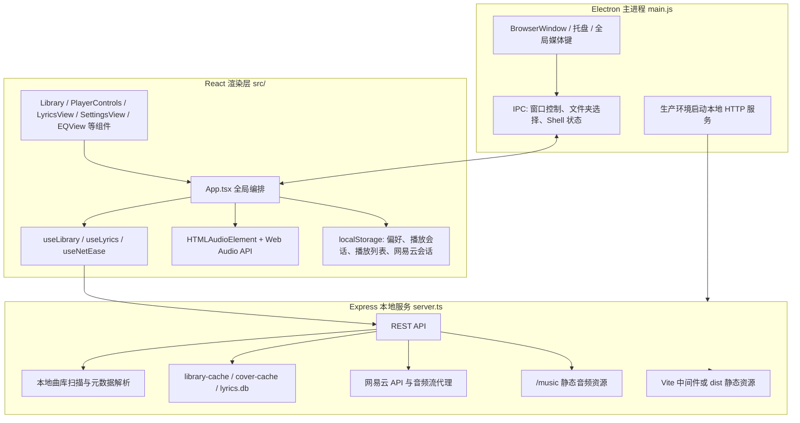

# RadiFlow Player Harness 文档

## 项目名

RadiFlow Player

## 介绍

RadiFlow Player 是一个桌面端音乐播放器，面向本地曲库、网易云音乐内容、沉浸式播放界面、同步歌词、播放列表、动态背景和均衡器等场景。项目不是单纯的前端页面，而是由 Electron 桌面壳、Express 本地服务和 React 渲染层共同组成的完整桌面应用。

核心能力包括：

- 扫描本地 `music/` 或用户选择的音乐目录。
- 读取音频元数据、时长、封面，并缓存扫描结果。
- 播放本地音频和代理播放网易云歌曲流。
- 支持播放、暂停、上一首、下一首、进度拖动、循环、随机、音量控制。
- 支持歌词检索、LRC/YRC 解析、逐行/逐字同步显示和手动歌词兜底。
- 支持本地播放列表、网易云歌单、网易云搜索、收藏歌曲/专辑。
- 支持动态背景、自定义背景、Windows 透明/Mica/Acrylic 材质、频谱可视化和 EQ 均衡器。

## 架构图



## 技术栈

| 层级 | 技术 |
| --- | --- |
| 桌面壳 | Electron 41 |
| 前端框架 | React 19、React DOM |
| 开发与构建 | Vite 6、TypeScript 5、tsx、esbuild |
| 本地服务 | Express 4、Node.js 20+、node:sqlite |
| 样式与 UI | Tailwind CSS 4、lucide-react、motion/react |
| 音频与元数据 | HTMLAudioElement、Web Audio API、music-metadata |
| 外部音乐服务 | `@neteasecloudmusicapienhanced/api` |
| 视觉辅助 | colorthief、Canvas 图片压缩、频谱可视化 |
| 打包 | electron-builder |

## 目录结构

```text
.
├── main.js                 Electron 主进程入口
├── server.ts               Express 本地服务入口
├── package.json            脚本、依赖、Electron Builder 配置
├── vite.config.ts          Vite / React / Tailwind 配置
├── tsconfig.json           TypeScript 配置
├── src/
│   ├── main.tsx            React 挂载入口
│   ├── App.tsx             播放、视图、状态、IPC、音频图的全局编排
│   ├── components/         曲库、播放器、歌词、设置、EQ、窗口控制等组件
│   ├── hooks/              本地曲库、歌词、网易云状态封装
│   ├── types/              播放器领域模型与持久化类型
│   ├── utils/              歌词解析等工具
│   └── lib/                文案与通用工具
├── music/                  默认本地音乐目录
├── player-data/            运行数据目录
├── scripts/                Electron 预览脚本
├── dist/                   前端构建产物
├── dist-electron/          服务端构建产物
└── release/                Electron 打包输出
```

## 模块职责

### Electron 主进程

入口文件为 `main.js`，职责包括：

- 创建无边框桌面窗口，设置最小尺寸 `1200 x 880`。
- 处理窗口最小化、最大化、关闭、圆角形状和 Windows 背景材质。
- 管理托盘菜单、全局媒体键、Windows 任务栏缩略图按钮和进度条。
- 通过 IPC 暴露文件夹选择、打开音乐目录、窗口控制、Shell 状态查询等平台能力。
- 生产环境下启动 `dist-electron/server.js`，并优先复用固定本地端口。
- 将 Shell 偏好写入 Electron `userData/shell-preferences.json`。

### 本地服务层

入口文件为 `server.ts`，职责包括：

- 启动 Express 服务，开发环境挂载 Vite middleware，生产环境服务 `dist/`。
- 通过 `/music` 提供当前音乐目录下的音频静态访问。
- 扫描 `.mp3`、`.wav`、`.flac`、`.m4a`、`.ogg` 文件。
- 使用 `music-metadata` 解析标题、歌手、专辑、时长、封面。
- 将曲库缓存到 `music/local/library-cache.json`。
- 将封面压缩打包到 `music/local/cover-cache.json.gz`。
- 使用 `node:sqlite` 保存歌词缓存和网易云收藏，数据库位于 `music/lyric/lyrics.db`。
- 代理网易云登录、搜索、歌单、收藏、专辑/歌手详情、歌词和音频流。

### React 渲染层

入口文件为 `src/main.tsx` 和 `src/App.tsx`，职责包括：

- 管理当前歌曲、播放队列、播放索引、播放状态、进度、音量、循环、随机。
- 管理本地播放列表、网易云歌单、曲库视图、搜索视图、设置页、EQ 页。
- 使用 `<audio>` 播放本地或网易云代理音频。
- 使用 Web Audio API 创建 `AnalyserNode` 和 10 段 `BiquadFilterNode` 均衡器。
- 将偏好、播放列表、播放会话和网易云会话写入 `localStorage`。
- 通过 IPC 接收托盘、媒体键、任务栏按钮发出的播放控制事件。

## HTTP 接口

服务默认开发端口为 `3000`，生产环境由 Electron 主进程启动本地服务并选择端口。

| 方法 | 路径 | 说明 |
| --- | --- | --- |
| GET | `/api/music` | 获取当前音乐目录的曲库。首次请求或未预热时会读缓存或扫描目录。 |
| GET | `/api/music?refresh=1` | 强制刷新曲库缓存并返回最新曲库。 |
| GET | `/api/settings/music-dir` | 获取当前音乐目录路径。 |
| POST | `/api/settings/music-dir` | 设置音乐目录。请求体：`{ "path": "..." }`。 |
| GET | `/api/library/cover/:coverId` | 根据封面资源 ID 返回缓存封面图片。 |
| GET | `/api/lyrics?title=&artist=&file=` | 获取歌词。优先网易云歌曲 ID，其次 SQLite 缓存、网易云搜索、手动歌词文件。 |
| GET | `/api/proxy/search?word=` | 兼容旧逻辑的网易云搜索代理。 |
| GET | `/api/proxy/lyric?id=` | 兼容旧逻辑的网易云歌词代理。 |
| GET | `/music/*` | 当前音乐目录下的静态音频文件访问。 |

### 网易云接口

| 方法 | 路径 | 说明 |
| --- | --- | --- |
| GET | `/api/netease/session` | 获取网易云登录状态。 |
| POST | `/api/netease/session` | 写入或清空网易云 Cookie。 |
| POST | `/api/netease/logout` | 退出网易云登录并清空本地会话。 |
| POST | `/api/netease/login/qr/start` | 创建二维码登录任务。 |
| GET | `/api/netease/login/qr/check?key=` | 轮询二维码登录状态。 |
| GET | `/api/netease/search/default` | 获取默认搜索词。 |
| GET | `/api/netease/search/hot` | 获取热搜词。 |
| GET | `/api/netease/search/hot/detail` | 获取热搜详情。 |
| GET | `/api/netease/search/suggest?keywords=&type=` | 获取搜索建议。 |
| GET | `/api/netease/search/multimatch?keywords=` | 获取多重匹配建议。 |
| GET | `/api/netease/search?keywords=&type=&limit=&offset=` | 搜索歌曲、专辑或歌手。 |
| GET | `/api/netease/album/:id` | 获取网易云专辑详情和歌曲。 |
| GET | `/api/netease/artist/:id` | 获取网易云歌手详情和歌曲。 |
| GET | `/api/netease/favorites` | 获取本地保存的网易云收藏歌曲和专辑。 |
| POST | `/api/netease/favorites` | 保存网易云歌曲或专辑收藏。 |
| DELETE | `/api/netease/favorites/:type/:id` | 删除网易云收藏。`type` 为 `song` 或 `album`。 |
| GET | `/api/netease/playlists` | 获取当前网易云账号歌单。需要登录。 |
| POST | `/api/netease/playlists` | 创建网易云歌单。需要登录。 |
| DELETE | `/api/netease/playlists/:id` | 删除网易云歌单。需要登录。 |
| POST | `/api/netease/playlists/:id/tracks` | 添加或删除歌单歌曲。请求体：`{ "op": "add|del", "trackIds": [] }`。 |
| GET | `/api/netease/playlist/:id` | 获取网易云歌单详情和歌曲。需要登录。 |
| GET | `/api/netease/song/stream/:id?level=` | 代理网易云音频流，支持 Range 相关响应头。 |

## Electron IPC 接口

| 通道 | 类型 | 说明 |
| --- | --- | --- |
| `select-music-folder` | `ipcMain.handle` | 打开系统目录选择器，返回选中的音乐目录。 |
| `get-music-folder` | `ipcMain.handle` | 返回主进程记录的当前音乐目录。 |
| `open-music-folder` | `ipcMain.handle` | 在系统文件管理器中打开音乐目录。 |
| `window:minimize` | `ipcMain.handle` | 最小化窗口。 |
| `window:toggle-maximize` | `ipcMain.handle` | 切换最大化状态并返回新状态。 |
| `window:close` | `ipcMain.handle` | 关闭窗口。 |
| `window:is-maximized` | `ipcMain.handle` | 查询当前窗口是否最大化。 |
| `window:set-background-material` | `ipcMain.handle` | 设置 Windows 背景材质：`none`、`mica`、`acrylic`、`tabbed`、`auto`。 |
| `window:get-background-material-support` | `ipcMain.handle` | 查询当前系统是否支持背景材质。 |
| `window:get-shell-state` | `ipcMain.handle` | 查询 Shell 支持信息和透明窗口状态。 |
| `window:restart-with-shell-mode` | `ipcMain.handle` | 写入透明窗口偏好并重启应用。 |
| `media:update-playback-state` | `ipcMain.on` | 渲染层上报播放状态，用于任务栏按钮和进度。 |
| `player-control` | 主进程发送 | 托盘、媒体键、任务栏按钮向渲染层发送 `toggle-play`、`next`、`prev`。 |
| `window:maximized-state-changed` | 主进程发送 | 窗口最大化状态变化通知。 |

## 核心数据模型

### Song

```ts
interface Song {
  title: string;
  artist: string;
  album?: string;
  cover?: string;
  duration?: number;
  lrc: string;
  file?: File | string;
}
```

### LibrarySongPayload

服务端返回给渲染层的曲库歌曲模型：

```ts
interface LibrarySongPayload {
  filename: string;
  fileUrl: string;
  title: string;
  artist: string;
  album?: string;
  cover?: string;
  duration?: number;
}
```

### PlaylistCollection

渲染层统一使用的本地/网易云播放列表模型：

```ts
interface PlaylistCollection {
  id: string;
  name: string;
  updatedAt: number;
  songs: Song[];
  source?: 'local' | 'netease';
  playlistCategory?: 'created' | 'followed';
  cover?: string;
  trackCount?: number;
}
```

### 持久化状态

- `apple-music-style-player.playlists`：本地播放列表定义。
- `apple-music-style-player.preferences`：语言、背景、音量、EQ、循环、随机等偏好。
- `apple-music-style-player.playback-session`：播放队列、当前歌曲、进度、视图状态。
- `radiflow-player.netease.session`：渲染层保存的网易云 Cookie 会话。
- `radiflow-player.netease-search-history`：网易云搜索历史。

## 缓存与数据位置

| 位置 | 内容 |
| --- | --- |
| `music/local/library-cache.json` | 本地曲库元数据缓存。 |
| `music/local/cover-cache.json.gz` | 封面图片压缩缓存包。 |
| `music/lyric/lyrics.db` | 歌词缓存和网易云收藏 SQLite 数据库。 |
| `music/lyric/*.lrc|*.yrc|*.txt` | 与音频文件同名的手动歌词兜底文件。 |
| Electron `userData/shell-preferences.json` | 透明窗口模式和音乐目录偏好。 |
| Electron `userData/server-port.json` | 生产环境本地服务最近成功端口。 |

## 运行与构建

### 安装依赖

```bash
npm install
```

### 开发模式

```bash
npm run dev
npm run electron:dev
```

`npm run dev` 使用 `tsx server.ts` 启动 Express + Vite 中间件；`npm run electron:dev` 会等待 `http://localhost:3000` 可用后启动 Electron。

### 构建

```bash
npm run build
```

构建流程：

1. `npm run build:renderer` 使用 Vite 构建前端到 `dist/`。
2. `npm run build:server` 使用 esbuild 构建 `server.ts` 到 `dist-electron/server.js`。

### Electron 预览与打包

```bash
npm run electron:preview
npm run dist:win
```

`electron:preview` 用于本地预览生产构建；`dist:win` 会使用 electron-builder 输出 Windows 目录包到 `release/`。

### 类型检查

```bash
npm run lint
```

当前 lint 脚本执行的是 `tsc --noEmit`。

## 关键流程

### 本地曲库加载

1. 渲染层 `useLibrary` 请求 `/api/music`。
2. 服务层优先读取 `library-cache.json`。
3. 如果缓存缺失或请求带 `refresh=1`，服务层扫描音乐目录。
4. 每个音频文件通过 `music-metadata` 解析元数据。
5. 封面写入 `cover-cache.json.gz`，歌曲返回 `/api/library/cover/:coverId` URL。
6. 渲染层将 `LibrarySongPayload` 转换为 `Song` 并进入曲库、播放列表和搜索视图。

### 播放流程

1. 用户在曲库或播放列表选择歌曲。
2. `App.tsx` 更新播放队列、当前索引和当前歌曲。
3. `<audio>` 加载本地 `/music/...` 或网易云 `/api/netease/song/stream/:id`。
4. Web Audio API 接入频谱分析和 EQ 滤波器。
5. 播放状态通过 IPC 上报给主进程，主进程更新任务栏按钮和进度。
6. 播放会话周期性写入 `localStorage`，下次启动可恢复。

### 歌词流程

1. `useLyrics` 根据当前歌曲请求 `/api/lyrics`。
2. 服务层优先按网易云歌曲 ID 拉取歌词。
3. 对本地歌曲，优先读 SQLite 缓存。
4. 缓存缺失时按标题和歌手搜索网易云歌词。
5. 网络失败或未命中时查找同名手动歌词文件。
6. 渲染层解析 LRC/YRC，合并翻译并渲染同步歌词。

### 网易云流程

1. 用户通过 Cookie 或二维码登录。
2. 服务层持有当前进程内网易云 Cookie 和账号摘要。
3. 渲染层通过 `useNetEase` 恢复会话、拉取歌单、加载歌单详情。
4. 搜索、收藏、专辑/歌手详情和音频流都通过本地服务代理。
5. 网易云收藏写入 `music/lyric/lyrics.db`，不是写入网易云远端收藏。

## 开发注意事项

- 渲染层通过 `window.require('electron').ipcRenderer` 访问 IPC，因此 Electron 窗口启用了 `nodeIntegration: true` 和 `contextIsolation: false`。
- 部分能力只能在 Electron 环境中完整工作，例如文件夹选择、窗口控制、任务栏控制和透明窗口模式。
- 网易云相关接口依赖外部网络和 Cookie 状态，应考虑 401、502、404 等失败分支。
- 曲库缓存与歌词数据库绑定到当前音乐目录，切换目录后服务层会重新加载/生成相关缓存。
- `readme-zh.md` 当前显示为乱码，中文维护文档建议以后统一使用 UTF-8 保存。

